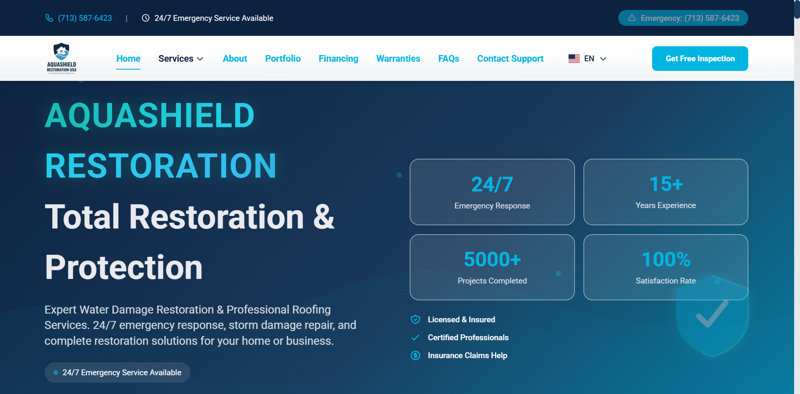
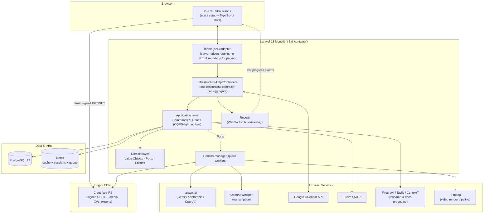
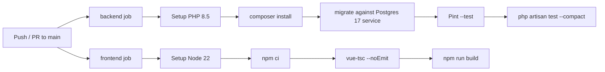

<p align="center">
  
</p>

<h1 align="center">Vidula</h1>

<p align="center">
  <b>An MVP I built for my own teaching workflow</b><br>
  Classroom management — students, enrollments, scheduling — plus an automated <b>video-pill editor</b> that transcribes a take,
  strips filler words and dead air, and renders a publishable clip. Laravel 13 + Inertia v3 + Vue 3, modular hexagonal monolith.
</p>

<p align="center">
  <a href="https://vidula.up.railway.app" target="_blank" rel="noopener noreferrer"></a>
  <a href="https://github.com/argenisdev692/vidula-laravel/actions/workflows/ci.yml"></a>
  
  
  
  
  
  
  
</p>

> **Note on scope.** Vidula is a **Laravel 13 + Inertia.js v3 + Vue 3 server-driven monolith**, not a static site generator. Sections below that would normally cover SSG/ISR or a Node build pipeline are replaced with the equivalent concerns for this architecture: server-rendered routing via Inertia, Vite-bundled Vue islands, and a modular hexagonal backend.

---

## Table of Contents

1. [Overview](#1-overview)
2. [Architecture](#2-architecture)
   - [2.1 System diagram](#21-system-diagram)
   - [2.2 Technology stack &amp; rationale](#22-technology-stack--rationale)
   - [2.3 Design patterns](#23-design-patterns)
   - [2.4 Rendering strategy](#24-rendering-strategy)
3. [Getting Started](#3-getting-started)
   - [3.1 Prerequisites](#31-prerequisites)
   - [3.2 Local installation (Sail)](#32-local-installation-sail)
   - [3.3 Environment variables](#33-environment-variables)
   - [3.4 Staging &amp; production](#34-staging--production)
   - [3.5 CLI reference](#35-cli-reference)
4. [Codebase Structure](#4-codebase-structure)
   - [4.1 Backend (`src/Modules`, `src/Shared`)](#41-backend-srcmodules-srcshared)
   - [4.2 Frontend (`resources/js`)](#42-frontend-resourcesjs)
   - [4.3 Design system &amp; tokens](#43-design-system--tokens)
   - [4.4 Assets &amp; media pipeline](#44-assets--media-pipeline)
   - [4.5 SEO](#45-seo)
5. [Development Workflow](#5-development-workflow)
   - [5.1 Git &amp; branching](#51-git--branching)
   - [5.2 CI/CD pipeline](#52-cicd-pipeline)
   - [5.3 Testing strategy](#53-testing-strategy)
   - [5.4 Code review](#54-code-review)
   - [5.5 Deployment](#55-deployment)
   - [5.6 Monitoring &amp; observability](#56-monitoring--observability)
6. [Performance](#6-performance)
7. [Security](#7-security)
8. [Contributing &amp; Maintenance](#8-contributing--maintenance)
9. [Project state](#9-project-state)
   - [9.1 AI-assisted development](#91-ai-assisted-development)
   - [9.2 Known gaps](#92-known-gaps)
10. [License](#10-license)

---

## 1. Overview

| | |
|---|---|
| **What it is** | An MVP built for my own teaching workflow — not a product with customers, not a multi-tenant SaaS |
| **Two things it actually does** | (1) **Classroom management**: students, enrollments, scheduling. (2) **Video-pill editing**: turn a raw take into a short publishable clip, automatically |
| **Primary user** | Me. Everything sits behind auth in a single-tenant admin panel; a few public surfaces (portfolio, blog, contact, booking) exist around it |
| **Deployment target** | Railway (`APP_URL=https://vidula.up.railway.app`), containerized via Laravel Sail images |
| **Audience for this document** | Engineers reading the codebase — including future me |

### The video-pill pipeline

This is the part worth looking at. `Modules/VideoExport` takes a raw recording and produces a finished clip without manual scrubbing:

| Step | Implementation |
|---|---|
| Transcribe with word-level timestamps | `OpenAiWhisperTranscriber` → `Domain/ValueObjects/WordTimestamp` |
| Detect filler words ("um", "like", …) | `Domain/Services/FillerCutDetector` |
| Detect dead air | `Domain/Services/SilenceCutParser` |
| Merge both into one non-overlapping cut list | `Domain/Services/CutPlanner` → `Domain/ValueObjects/TimeRange` |
| Clean the audio | `AudioEnhanceChain` + `FfmpegArnndnAudioDenoiseAdapter` (RNNoise) |
| Check the take against the intended script | `ReviewScriptAgainstTranscriptAgent` |
| Render | `VideoExportPipeline` on the `video-export` Horizon queue, low-memory mode for small containers |

Upload goes browser → R2 via presigned PUT (no binary through the app server); progress streams back over Reverb.

### Classroom management

`Students` + `Enrollments` for roster and course registration, `Appointment` / `Meeting` / `Availability` for scheduling (Google Calendar sync, holiday-aware slot resolution), `Products` for AI-assisted course outlines.

### Everything else

The remaining ~17 modules (`Clients`, `Invoices`, `Campaigns`, `SocialMedia`, `AiResumeStudio`, `Portfolio`, `Blog`, …) are **exploratory** — built to exercise the architecture across many shapes of domain, not because the MVP needs them. See [4.1](#41-backend-srcmodules-srcshared) for the core/supporting/exploratory split. The architecture is deliberately over-specified relative to the feature set; practising the pattern at scale was part of the point.

The screenshot above is a client-facing site rendered through the `Portfolio`/`Products` modules — output the platform can produce, not the admin UI itself.

---

## 2. Architecture

### 2.1 System diagram



### 2.2 Technology stack & rationale

<details>
<summary><b>Backend</b></summary>

| Technology | Version | Why this, not an alternative |
|---|---|---|
| **PHP** | 8.5 | Native readonly classes, enums, constructor promotion, first-class attributes — required by the hexagonal architecture (immutable DTOs/Value Objects, `#[AsEventListener]` auto-discovery). |
| **Laravel** | 13 | Batteries-included framework (queues, broadcasting, auth scaffolding) that still allows a strict hexagonal layering on top via `src/Modules` — avoids reinventing infrastructure concerns (mail, cache, queue drivers) while keeping domain logic framework-agnostic. |
| **Inertia.js v3** | ^3.0 | Server-side routing + client-side rendering without hand-rolling a REST/GraphQL API for every internal page. Removes the SPA-vs-MPA trade-off: full Laravel auth/session model, zero duplicate routing layer. |
| **PostgreSQL** | 17 | JSONB columns for AI-generated content payloads (product outlines, resume drafts), strong constraint/enum support, and first-class support on Railway. |
| **Redis** | latest | Backs cache, session, queue (`QUEUE_CONNECTION=redis`) and the account-lockout counter (`CacheAccountLockoutAdapter`) — single dependency for three concerns. |
| **Laravel Horizon** | ^5.47 | Observability and control plane for the `video-export` and default queues (long-running FFmpeg/AI jobs need visible retries/backoff, not silent `queue:work`). |
| **Laravel Reverb** | ^1.10 | Self-hosted WebSocket server for AI generation progress (`PostAiGenerationProgress`, campaign/product pipelines) — avoids a third-party Pusher bill for a single-tenant internal tool. |
| **laravel/ai** | ^0.8 | Single official LLM bridge (Gemini/Anthropic/OpenAI selectable via `AI_PROVIDER`) wrapped by `LaravelAIAdapter` + a `CircuitBreaker` — one integration point instead of N provider SDKs scattered across modules. |
| **spatie/laravel-permission** | ^8.1 | Battle-tested RBAC (roles + granular permissions) consumed by both backend policies and frontend `PermissionGuard.vue` — avoids hand-rolled ACL tables. |
| **spatie/laravel-medialibrary** + **Cloudflare R2** | ^11.23 | S3-compatible object storage without egress fees, used for CVs, video exports, campaign images and profile photos via signed URLs. |
| **pbmedia/laravel-ffmpeg** | ^8.9 | Declarative FFmpeg pipeline for the video-export module (filler-word removal, AI denoise, low-memory renders for constrained containers). |
| **dedoc/scramble** | ^0.13 | Zero-annotation OpenAPI generation straight from typed controllers/FormRequests — keeps API docs in sync without a separate spec-writing step. |
| **laravel/fortify** + **pragmarx/google2fa** | ^1.36 / ^3.0 | Headless auth scaffolding (2FA, password policies, session management) so the Vue layer owns 100% of the UI while Laravel owns the security-critical flows. |
| **laravel/telescope** (dev) | ^5.20 | Local request/query/job introspection during development; disabled in test env (`TELESCOPE_ENABLED`). |

</details>

<details>
<summary><b>Frontend</b></summary>

| Technology | Version | Why this, not an alternative |
|---|---|---|
| **Vue 3.5** (`<script setup lang="ts">`) | ^3.5.39 | Composition API + strict TypeScript for a codebase with 24 business modules — Options API would not scale the same composable-reuse patterns (`useEntityMutations`, `useEntity`). |
| **TypeScript (strict)** | ^6.0 | No `any`, no `@ts-ignore` project-wide — catches contract drift between Spatie Data DTOs and frontend `types.ts` mirrors at compile time. |
| **Pinia v3** | ^3.0.4 | Typed client-state stores (UI state only — sidebar, filters, theme); explicitly forbidden from mirroring server state. |
| **Pinia Colada** | ^1.3 | Server-state cache (`useQuery`/`useMutation`) paired with PrimeVue's server-side `:lazy` DataTable — avoids the boilerplate of manual loading/error/cache-invalidation state per page. |
| **PrimeVue v4 (unstyled) + Volt** | ^4.5.5 | 50+ accessible (WCAG AA) primitives consumed via a **code-ownership** model (`npx volt-vue add`) rather than a themed npm package — full control over markup/behavior while inheriting upstream a11y work. |
| **Tailwind CSS v4** + `tailwindcss-primeui` | ^4.3 | Utility-first styling with a token bridge (`--p-*` variables derived from `--bg-*`/`--text-*`/`--accent-*` in `globals.css`) so Volt primitives never hardcode colors. |
| **@primevue/forms + Zod v4** | ^4.5 / ^4.4 | Schema-first form validation shared between the visual form and its TypeScript type (`z.infer<>`), mirroring backend FormRequest rules. |
| **Vite 8** + `laravel-vite-plugin` + `@inertiajs/vite` | ^8.0 | Native ESM dev server with HMR, automatic manifest generation for Blade, and Inertia v3's page-resolution plugin (SSR wiring available, currently off — see [2.4](#24-rendering-strategy)). |
| **@fullcalendar/vue3** | ^6.1 | Calendar UI for `Meeting`/`Appointment`/`Availability` — avoided building a custom scheduling grid. |
| **vuedraggable**, **vue-advanced-cropper**, **signature_pad** | latest | Point solutions for drag-reorder (product outlines, gallery images), image cropping (profile/portfolio photos), and signature capture (contracts) — no generic "kitchen sink" UI kit pulled in for these. |

</details>

<details>
<summary><b>Alternatives considered</b></summary>

| Decision | Alternative(s) considered | Why rejected |
|---|---|---|
| Inertia.js v3 monolith | Separate Vue SPA + Laravel REST/Sanctum API | Would double the auth/authorization surface (session + token) and require hand-maintained OpenAPI contracts for pages that are 100% internal. Sanctum API is still exposed per-module for genuinely external consumers (mobile, integrations). |
| PrimeVue (unstyled) + Volt | Headless UI kits requiring a full custom component library (Radix-Vue, custom Tailwind components) | Volt ships 50+ WCAG AA components pre-built, code-owned (no vendor lock-in), and already themeable via the existing token bridge — building an equivalent library from scratch was out of scope for a solo-maintained product. |
| `laravel/ai` single bridge | Direct SDKs per provider (`openai-php`, Anthropic SDK, Gemini SDK) | One adapter (`LaravelAIAdapter`) + one `CircuitBreaker` covers provider failover via `AI_PROVIDER` without triplicating retry/rate-limit/PII-redaction logic across three SDKs. |
| Cloudflare R2 | AWS S3 | S3-compatible API (same `league/flysystem-aws-s3-v3` driver) with zero egress fees — relevant given the module renders/exports video and CV files regularly. |
| PostgreSQL | MySQL/MariaDB | JSONB + partial indexes fit the AI-generated content payloads (`Products`, `AiResumeStudio`) better; also the CI matrix and Railway target both standardize on Postgres 17. |

</details>

### 2.3 Design patterns

The backend follows a **modular hexagonal architecture** documented in `.claude/skills/ARCHITECTURE-PHP/SKILL.md`. Summary of the patterns actually in force (not aspirational):

| Pattern | Where | Notes |
|---|---|---|
| **Ports & Adapters (Hexagonal)** | `Domain/Ports/*Port.php` ↔ `Infrastructure/*Adapter.php` | Domain never imports Eloquent, HTTP, or a 3rd-party SDK directly. |
| **DDD tactical patterns** | `Domain/ValueObjects`, `Domain/Entities`, `Domain/Events` | Value Objects (`Uuid`, `Email`, `Money`, `DateRange`) applied where invariants exist; entities are **opt-in** — skipped when the Eloquent model is 1:1 with the aggregate (Lean Mode, see skill file). |
| **CQRS (basic, no bus)** | `Application/Commands/*Handler.php` (writes) vs. `Application/Queries/*Handler.php` (reads) | One handler per use case; a `CommandBus`/`QueryBus` is an documented upgrade path, adopted only past a module-complexity threshold. |
| **Repository pattern** | `Infrastructure/Persistence/Repositories/Eloquent{Entity}Repository.php` | One repository per aggregate, implementing a `Domain/Ports/{Entity}RepositoryPort`. |
| **Event-driven / pub-sub** | `Domain/Events/*.php` + `#[AsEventListener]` | Domain events fire post-commit; cross-module reactions live in the **consuming** module, never the emitter (explicit anti-corruption boundary). |
| **Circuit Breaker** | `Shared/Infrastructure/Resilience/CircuitBreaker/*` | Wraps `LaravelAIAdapter` calls so a degraded AI provider fails fast instead of exhausting queue workers. |
| **DTO / Data Transfer Objects** | `spatie/laravel-data` across every `Application/DTOs` | Doubles as the "Command" object in CQRS — no parallel Command class per use case. |
| **Mapper (opt-in)** | `Infrastructure/Persistence/Mappers/{Entity}Mapper.php` | Only created when persistence shape diverges from the domain aggregate. |
| **Controller Fusion** | `Infrastructure/Http/Controllers/{Entity}Controller.php` | One controller serves both Inertia (web) and JSON (API), branching on `$request->expectsJson()`, per the project's documented SRP trade-off. |

On the frontend: **composable-based state separation** (Pinia = client UI state, Pinia Colada = server state — never mixed), **code-owned design system** (Volt primitives copied into the repo, customized only via `pt` pass-through, never inline overrides), and **schema-first forms** (Zod schema is the single source of truth for both validation and the TS type).

### 2.4 Rendering strategy

Vidula does **not** use SSG/ISR — it is a **CSR SPA delivered through Inertia.js v3** on top of Laravel's own routing:

- Every navigation is a full Laravel route resolving an `Inertia::render()` call; the Vue component tree hydrates client-side.
- `vite.config.ts` explicitly disables SSR (`inertia({ ssr: false })`) until a `resources/js/ssr.ts` entry is added — first-paint is currently client-rendered, which is an accepted trade-off since the primary surface is an authenticated back-office tool, not a public marketing site.
- Public-facing pages (`Portfolio`, `Blog`, service pages) still benefit from Laravel-side meta-tag injection and `spatie/laravel-sitemap` for crawlability (see [4.5 SEO](#45-seo)) even without SSR.
- **Performance budget status**: no Core Web Vitals budget is currently enforced in CI. See [6. Performance](#6-performance) for the honest current state and the recommended next step (Lighthouse CI on the public routes).

---

## 3. Getting Started

### 3.1 Prerequisites

| Tool | Version | Purpose |
|---|---|---|
| [Docker Desktop](https://www.docker.com/products/docker-desktop/) / Docker Engine + Compose v2 | latest | Runs the Sail stack (`laravel.test`, `pgsql`, `redis`, `horizon`, `reverb`, `scheduler`) |
| [Node.js](https://nodejs.org/) | 22.x (matches `.github/workflows/ci.yml`) | Vite build + `vue-tsc` type-checking |
| [Composer](https://getcomposer.org/) | 2.x | Only needed on the host if you don't run `composer` through Sail for the very first install |
| Git | 2.4x+ | Version control |
| A code editor with PHP 8.5 + Vue/TS language support | — | VS Code / Cursor / PhpStorm all work; this repo ships `.editorconfig` |

> This project runs **inside Laravel Sail's Docker containers**. Every PHP/Artisan/Composer command below is prefixed with `vendor/bin/sail` — never run bare `php`.

### 3.2 Local installation (Sail)

```bash
# 1. Clone
git clone https://github.com/argenisdev692/vidula-laravel.git
cd vidula-laravel

# 2. Environment
cp .env.example .env

# 3. Install PHP dependencies (uses a throwaway PHP 8.5 container the first time)
composer install

# 4. Boot the stack (Postgres, Redis, Horizon, Reverb, scheduler, app)
vendor/bin/sail up -d

# 5. App key + migrations
vendor/bin/sail artisan key:generate
vendor/bin/sail artisan migrate

# 6. Frontend dependencies + dev server
vendor/bin/sail npm install
vendor/bin/sail npm run dev
```

<details>
<summary>Expected output — <code>vendor/bin/sail up -d</code></summary>

```
[+] Running 6/6
 ✔ Network vidula-laravel_sail    Created
 ✔ Container vidula-laravel-redis-1        Started
 ✔ Container vidula-laravel-pgsql-1        Started
 ✔ Container vidula-laravel-laravel.test-1 Started
 ✔ Container vidula-laravel-horizon-1      Started
 ✔ Container vidula-laravel-reverb-1       Started
 ✔ Container vidula-laravel-scheduler-1    Started
```
</details>

<details>
<summary>Expected output — <code>vendor/bin/sail artisan migrate</code></summary>

```
   INFO  Running migrations.

  2026_07_11_090000_create_appointments_table ................ 45ms DONE
  2026_..._create_products_table .............................. 38ms DONE
  ... (one line per migration)
```
</details>

The app is now available at `http://localhost` (or `${APP_PORT}`, default `8080` per `compose.yaml`), Vite HMR on `${VITE_PORT}` (default `5173`), and Reverb on `${FORWARD_REVERB_PORT}` (default `8081`).

Run everything (server + queue + logs + Vite) in one terminal instead:

```bash
composer run dev
```

### 3.3 Environment variables

Full reference lives in `.env.example` (single source of truth — do not let this table drift from it). Grouped by concern:

<details>
<summary><b>Core application</b></summary>

| Variable | Example | Notes |
|---|---|---|
| `APP_NAME` | `Vidula` | Also drives `VITE_APP_NAME` |
| `APP_ENV` | `local` \| `staging` \| `production` | |
| `APP_KEY` | *(generated)* | `sail artisan key:generate` |
| `APP_DEBUG` | `true` (dev only) | **Must be `false` in production** — no stack traces/SQL errors leaked |
| `APP_URL` | `https://vidula.up.railway.app` | Also the primary CORS/R2 origin |
| `SESSION_DRIVER` / `SESSION_SECURE_COOKIE` | `database` / `true` | Secure cookies enforced outside local dev |

</details>

<details>
<summary><b>Database, cache, queue, realtime</b></summary>

| Variable | Example |
|---|---|
| `DB_CONNECTION` | `pgsql` |
| `REDIS_HOST` / `REDIS_PORT` / `REDIS_PASSWORD` | `127.0.0.1` / `6379` / `null` |
| `QUEUE_CONNECTION` / `CACHE_STORE` | `redis` / `redis` |
| `REVERB_APP_ID` / `REVERB_APP_KEY` / `REVERB_APP_SECRET` | generated per environment |
| `VITE_REVERB_*` | mirrors the `REVERB_*` values for the frontend client |

</details>

<details>
<summary><b>Storage (Cloudflare R2)</b></summary>

| Variable | Example |
|---|---|
| `FILESYSTEM_CLOUD` | `r2` |
| `R2_ACCOUNT_ID` / `R2_ACCESS_KEY_ID` / `R2_SECRET_ACCESS_KEY` | from the Cloudflare dashboard |
| `R2_BUCKET` / `R2_ENDPOINT` / `R2_PUBLIC_BASE_URL` | bucket-specific |
| `R2_CORS_EXTRA_ORIGINS` | `http://localhost:5173,https://vidula.up.railway.app` | comma-separated browser origins allowed on the bucket CORS policy |

</details>

<details>
<summary><b>AI providers &amp; research</b></summary>

| Variable | Example | Notes |
|---|---|---|
| `AI_PROVIDER` | `gemini` \| `anthropic` \| `openai` | Selects the provider inside `LaravelAIAdapter` |
| `GEMINI_API_KEY` / `GEMINI_TEXT_MODEL` / `GEMINI_IMAGE_MODEL` | | |
| `ANTHROPIC_API_KEY` / `ANTHROPIC_TEXT_MODEL` | | |
| `OPENAI_API_KEY` / `OPENAI_TEXT_MODEL` / `OPENAI_WHISPER_MODEL` | | Whisper is required specifically for Video Export word-level timestamps |
| `ELEVENLABS_API_KEY` / `ELEVENLABS_VOICE_ID` | | AI voice-over |
| `FIRECRAWL_API_KEY` | | Resume Studio job-page scraping |
| `TAVILY_API_KEY` | | Web research grounding |
| `CONTEXT7_API_KEY` | | Library-doc grounding for AI-generated content (degrades gracefully without a key) |
| `REPLICATE_API_TOKEN` / `REPLICATE_IMAGE_MODEL` | | AI image generation for campaigns/posts |

</details>

<details>
<summary><b>Video export pipeline (FFmpeg)</b></summary>

| Variable | Example | Notes |
|---|---|---|
| `FFMPEG_BINARIES` / `FFPROBE_BINARIES` | `ffmpeg` / `ffprobe` | |
| `VIDEO_EXPORT_QUEUE` | `video-export` | Must match the Horizon supervisor in `config/horizon.php` |
| `VIDEO_EXPORT_LOW_MEMORY*` | `true` / `ultrafast` / `1` | Caps threads for small containers (Railway) to avoid OOM kills |

</details>

<details>
<summary><b>Auth &amp; security</b></summary>

| Variable | Example | Notes |
|---|---|---|
| `HASH_DRIVER` | `argon2id` | See `config/hashing.php` |
| `AUTH_LOCKOUT_ATTEMPTS` / `AUTH_LOCKOUT_MINUTES` | `3` / `60` | Redis-backed brute-force lockout |
| `AUTH_MANDATORY_2FA` | `false` | When `true`, forces `SUPER_ADMIN`/`ADMIN` through TOTP setup |
| `SANCTUM_STATEFUL_DOMAINS` | `localhost,127.0.0.1` | |
| `SECURITY_CSP_CONNECT_SRC` / `SECURITY_CSP_IMG_SRC` | | Extra CSP origins beyond the R2 + Google Maps allowlist baked into `config/security.php` |
| `GOOGLE_CLIENT_ID` / `GOOGLE_CLIENT_SECRET` | | Socialite login **and** Google Calendar OAuth share this app registration |

</details>

<details>
<summary><b>Third-party integrations</b></summary>

| Variable | Example |
|---|---|
| `MAIL_MAILER` / `MAIL_HOST` | `brevo` / `smtp-relay.brevo.com` (Resend as documented fallback) |
| `GOOGLE_CALENDAR_ID` / `GOOGLE_CALENDAR_OAUTH_REDIRECT_URI` | Meeting scheduling sync |
| `GOOGLE_MAPS_API_KEY` | Address autocomplete (`usePlacesAutocomplete`) |
| `GITHUB_CLIENT_ID` / `GITHUB_TOKEN` | Socialite login + GitHub portfolio enrichment for Resume Studio |

</details>

### 3.4 Staging & production

| Environment | Notes |
|---|---|
| **Local (dev)** | `vendor/bin/sail up -d` + `npm run dev` — Vite HMR, `APP_DEBUG=true`, `TELESCOPE_ENABLED=true` for request/query inspection. |
| **CI** | GitHub Actions spins up a disposable Postgres 17 service container, runs Pint + PHPUnit for the backend and `vue-tsc` + `vite build` for the frontend on every push/PR to `main` (see [5.2](#52-cicd-pipeline)). |
| **Production (Railway)** | `APP_URL=https://vidula.up.railway.app`, `APP_DEBUG=false`, `SESSION_SECURE_COOKIE=true`, assets built via `npm run build` and served through Laravel's Vite manifest. R2 CORS is kept in sync via `php artisan r2:sync-cors`. Horizon and Reverb run as separate long-lived processes (mirrored by `compose.yaml`'s `horizon`/`reverb`/`scheduler` services). |

> There is currently no committed staging-specific configuration beyond environment variables — promote by pointing the same container image at a staging `.env` (`APP_ENV=staging`) with an isolated database/Redis instance before merging to `main`.

### 3.5 CLI reference

Project-specific Artisan commands (beyond the framework defaults):

```bash
# Sync country public holidays used by the Availability resolver
vendor/bin/sail artisan availability:sync-holidays

# Publish campaigns/posts/social content whose scheduled_at has elapsed
vendor/bin/sail artisan campaigns:publish-scheduled
vendor/bin/sail artisan posts:publish-scheduled
vendor/bin/sail artisan social-media:publish-scheduled

# Kick off the daily AI Resume Studio batch run
vendor/bin/sail artisan resume-studio:run-daily

# Archive activity-log entries past retention
vendor/bin/sail artisan activity-log:archive

# Re-sync Cloudflare R2 bucket CORS origins from R2_CORS_EXTRA_ORIGINS
vendor/bin/sail artisan r2:sync-cors

# Google Calendar OAuth bootstrap / smoke test
vendor/bin/sail artisan google:oauth-token
vendor/bin/sail artisan google:calendar-test
```

<details>
<summary>Expected output — <code>availability:sync-holidays</code></summary>

```
Syncing public holidays for 3 configured countries...
  [PT] 2026: 13 holidays synced
  [ES] 2026: 14 holidays synced
  [US] 2026: 11 holidays synced
Done.
```
</details>

Everyday commands:

```bash
vendor/bin/sail artisan test --compact                       # full backend test suite
vendor/bin/sail artisan test --compact tests/Feature/X.php    # single file
vendor/bin/sail artisan test --compact --filter=testName      # single test
vendor/bin/sail bin pint --format agent                        # fix PHP code style
vendor/bin/sail npm run build                                  # production frontend bundle
npx vue-tsc --noEmit                                            # frontend type-check (host or container)
vendor/bin/sail artisan route:list --except-vendor              # inspect routes
vendor/bin/sail artisan horizon                                 # queue dashboard worker (also auto-started by compose.yaml)
```

---

## 4. Codebase Structure

### 4.1 Backend (`src/Modules`, `src/Shared`)

PSR-4 autoload maps two flat namespaces on top of the default Laravel `app/`:

```json
"autoload": {
  "psr-4": {
    "App\\": "app/",
    "Modules\\": "src/Modules/",
    "Shared\\": "src/Shared/"
  }
}
```

```
src/
├── Shared/                      # Cross-cutting kernel — no business rules
│   ├── Domain/                  # Base exceptions, Value Objects (Uuid, Email, Money…), Ports
│   ├── Application/             # Base DTOs, transaction helpers
│   ├── Infrastructure/
│   │   ├── AI/                  # LaravelAIAdapter (Gemini/Anthropic/OpenAI behind one interface)
│   │   ├── Resilience/           # CircuitBreaker protecting AI + external calls
│   │   ├── Storage/              # R2/S3/local adapters (StoragePort)
│   │   ├── Research/, Docs/, Speech/  # Tavily, Context7, ElevenLabs adapters
│   │   ├── Audit/                 # spatie/laravel-activitylog adapter
│   │   ├── Console/Commands/      # r2:sync-cors, etc.
│   │   ├── Middleware/            # SecurityHeaders, CorrelationId, HandleInertiaRequests
│   │   └── Providers/             # SharedServiceProvider, BusServiceProvider, EventServiceProvider
│   └── Providers/
│
└── Modules/                      # 24 bounded contexts, identical internal shape:
    │
    │   ── CORE (what the MVP is for) ────────────────────────────────
    ├── VideoExport/                         # video-pill pipeline: Whisper → filler/silence cuts → denoise → render
    ├── Students/ Enrollments/               # classroom roster & course registration
    ├── Appointment/ Meeting/ Availability/  # scheduling (Google Calendar sync, holiday-aware slots)
    │
    │   ── SUPPORTING (needed for the core to run) ───────────────────
    ├── Auth/ Authorization/ Users/          # sessions, 2FA, RBAC
    ├── ActivityLog/ Backup/                 # ops & audit trail
    │
    │   ── EXPLORATORY (architecture practice, not MVP scope) ────────
    ├── Products/                            # AI content generator (course outlines)
    ├── AiResumeStudio/ Cvs/                 # AI resume/CV pipeline
    ├── Clients/ Services/ Invoices/         # CRM & billing
    ├── Blog/ Post/ Campaigns/ SocialMedia/  # content marketing automation
    └── Portfolio/ Company/ ContactSupport/  # public-facing + company data
        │
        ├── Providers/{Module}ServiceProvider.php   # registerWebRoutes() + registerApiRoutes()
        ├── Tests/{Feature,Unit}/
        ├── Domain/{Entities,ValueObjects,Ports,Events}/
        ├── Application/{DTOs,Commands,Queries,Listeners}/
        └── Infrastructure/
            ├── Http/{Controllers,Requests,Export}/
            ├── Persistence/{Eloquent/Models,Repositories,Mappers}/
            └── Routes/{web,api}.php
```

Layer-import rules are enforced by convention (see `.claude/skills/ARCHITECTURE-PHP/SKILL.md`): **Domain** never imports Eloquent/HTTP/Laravel facades; **Application** may only import Laravel *contracts* (interfaces); **Infrastructure** is the only layer allowed to import concrete framework/SDK code.

### 4.2 Frontend (`resources/js`)

```
resources/js/
├── app.ts                # Inertia v3 entry — registers Pinia, Pinia Colada, PrimeVue (unstyled), Toast, tooltip
├── volt/                 # Code-owned PrimeVue v4 unstyled primitives (Button, DataTable, Dialog, Toast, …)
├── lib/                  # cn() (clsx + tailwind-merge) and other framework-agnostic helpers
├── common/               # Domain-agnostic compositions on top of volt/ (DataTable shell, form fields, export button…)
├── modules/               # Domain-specific composables/stores/schemas, one folder per bounded context
│   ├── app/               # Sidebar, theme store (light/dark via `.dark` class only)
│   ├── auth/, users/, cvs/, meeting/, campaigns/, activity-log/, …
│   └── {context}/{components,composables,stores,schemas,helpers,types.ts}
├── pages/                 # Inertia pages — mirrors URL structure (Index/Show/Create/Edit per entity)
│   └── {entity}/{Index,Show,Create,Edit}.vue + components/ (page-private)
└── vite-env.d.ts
```

Strict import direction: `volt/` → `common/` → `modules/` → `pages/`, never the reverse. Server state (lists, single records, mutations) always goes through Pinia Colada composables in `modules/{context}/composables/`; Pinia stores are reserved for pure client UI state (filters open/closed, view density, theme).

### 4.3 Design system & tokens

- **Single source of truth**: `resources/css/globals.css` defines core tokens (`--bg-*`, `--text-*`, `--accent-*`, spacing/typography scale). `tailwindcss-primeui` derives its `--p-*` semantic bridge from these so Volt components never hardcode a color.
- **Dark-first**: theme is toggled purely via the `.dark` class on `<html>` (no `data-theme`, no `.light` class); a FOUC-killer script in the Blade shell applies `.dark` on first paint before Vue hydrates.
- **Typography**: `JetBrains Mono Variable` is the project font end-to-end (`--font-sans` = `--font-mono`) — a deliberate branding choice for a developer/creator-tool audience, not an oversight.
- **Component customization**: never inline `class` overrides on a Volt primitive — always the component's `pt` (pass-through) config, per `FRONTEND/SKILL.md`.

### 4.4 Assets & media pipeline

| Asset type | Pipeline |
|---|---|
| Profile photos, portfolio galleries, campaign/post images | Uploaded via Vue (`vue-advanced-cropper` for cropping) → `spatie/laravel-medialibrary` → Cloudflare R2, served through signed URLs |
| CV/resume exports | `phpoffice/phpword` (DOCX) + `barryvdh/laravel-dompdf` (PDF) rendered server-side, stored on R2 |
| Video course exports | Client uploads segments directly to R2 via presigned PUT (`PresignUploadData`) → Horizon job runs the FFmpeg pipeline (`pbmedia/laravel-ffmpeg`) with configurable low-memory mode → final render written back to R2 |
| AI-generated images (campaigns/posts) | Replicate API → stored under `ai/campaigns` / `ai/posts` on R2 |
| QR codes (invoices, etc.) | `bacon/bacon-qr-code` |
| Excel/CSV exports | `spatie/simple-excel`, one `{Entity}ExcelExport` + `{Entity}ExportTransformer` per module |

### 4.5 SEO

- `spatie/laravel-sitemap` generates the sitemap for public routes (`Portfolio`, `Blog`, `Services`).
- `HomeController` and public module controllers pass per-page meta props to Inertia for title/description injection into the Blade shell.
- `public/.htaccess` present for Apache-style deployments; Railway serves through the Sail-built container instead.
- **Known gap (be transparent about it)**: there is no committed `robots.txt` audit or structured-data (JSON-LD) layer yet — flagged here rather than glossed over, since public pages (`Portfolio`, `Blog`) would benefit most from it.

---

## 5. Development Workflow

### 5.1 Git & branching

**Trunk-based development** against `main`:

- `main` is always deployable; feature branches are short-lived and merged via PR.
- Conventional Commits are used for commit messages (`feat:`, `fix:`, `refactor:`, `test:`, `chore:`, `docs:`) — enables automated changelog generation later without retrofitting history.
- No long-lived `develop`/`release` branches — CI gate on `main` (Pint + PHPUnit + typecheck + build) is the release gate.

### 5.2 CI/CD pipeline

`.github/workflows/ci.yml` runs on every push/PR to `main`:



Both jobs run in parallel and must pass before merge. There is no separate CD stage committed to the repo yet — deployment to Railway is triggered outside this workflow (Railway's own GitHub integration / manual promotion).

### 5.3 Testing strategy

| Layer | Tool | Location | Status |
|---|---|---|---|
| Unit | PHPUnit 12 | `tests/Unit/`, `src/Modules/*/Tests/Unit/` (opt-in — only where domain invariants exist) | Present for VOs/services with real logic (e.g. `LibraryNameDetector`, `SeedOutlineParser`) |
| Feature | PHPUnit 12 | `src/Modules/*/Tests/Feature/` (mandatory per module) | 100 test files across 24 modules as of this writing — heavily skewed: `Auth` (22), `Post` (7), `SocialMedia`/`Availability` (6 each), while the core `VideoExport` and `Enrollments` modules have 1 file each. See [9.2](#92-known-gaps). |
| Frontend type safety | `vue-tsc --noEmit` | CI `frontend` job | Gate on strict TS, not a runtime test |
| E2E | — | — | **Not yet implemented.** No Playwright/Cypress suite exists; recommended next step given the number of multi-step flows (video export, resume studio, appointment booking) |

Run the suite:

```bash
vendor/bin/sail artisan test --compact                 # everything
vendor/bin/sail artisan test --compact --filter=Name    # targeted
```

### 5.4 Code review

- All changes land via pull request against `main`; CI (Pint + PHPUnit + typecheck + build) must be green.
- Backend PRs are expected to respect the layer-import rules in `.claude/skills/ARCHITECTURE-PHP/SKILL.md` (Domain/Application/Infrastructure boundaries) and the OWASP baseline in `.claude/OWASP/SKILL.md`.
- Frontend PRs are expected to respect the module boundaries in `.claude/skills/ARCHITECTURE-VUE/SKILL.md` (`volt/` → `common/` → `modules/` → `pages/` import direction) and ship strict TypeScript with no `any`.
- `spatie/laravel-activitylog` provides an audit trail for reviewed data-mutating changes in production (`logOnly([...])`, never `logAll()`).

### 5.5 Deployment

| Strategy | Applicability here |
|---|---|
| **Rolling** | Current model — Railway rebuilds and swaps the container on deploy; Horizon/Reverb/scheduler run as separate long-lived services per `compose.yaml`, so a deploy briefly interrupts queue processing until the new container is healthy. |
| **Blue-green** | Not implemented — would require a second Railway environment + traffic switch, worth evaluating once video-export/queue downtime during deploys becomes a measured problem. |
| **Canary** | Not implemented — single-tenant internal tool with a small user base; the cost of a canary pipeline currently outweighs the benefit. |

Migrations run via `php artisan migrate --force` as part of the deploy step (see `composer.json`'s `post-create-project-cmd` for the equivalent local bootstrap).

### 5.6 Monitoring & observability

| Concern | Tool | Notes |
|---|---|---|
| Queue/job visibility | **Laravel Horizon** | Dashboard at `/horizon` (auth-gated), tracks the `default` and `video-export` queues |
| Local request/query/job inspection | **Laravel Telescope** (dev only) | `TELESCOPE_ENABLED=false` in tests, on in local dev |
| Structured audit trail | **spatie/laravel-activitylog** | `ActivityLog` module — `logOnly([...])` per model, never full-table logging |
| Application logs | Laravel's `stack`/`single` channel | `LOG_LEVEL` configurable per environment |
| Realtime job progress | **Reverb** broadcast events | e.g. `PostAiGenerationProgress` streamed to the Vue client during AI content generation |
| APM / tracing / metrics export | — | **Not implemented.** No OpenTelemetry/Prometheus exporter is wired up yet, despite the architecture skill documenting an optional `Infrastructure/Observability/` slot for it — flagged as a genuine gap, not a hidden feature. |

---

## 6. Performance

Being direct about current status rather than presenting invented numbers:

| Metric | Status |
|---|---|
| Lighthouse scores | **Not currently measured/tracked in CI.** Recommended: add a Lighthouse CI step against the public routes (`/`, `/portfolio`, `/blog`) since those are the only unauthenticated, SEO-relevant pages. |
| Bundle size analysis | **Not currently tracked.** `vite build` produces the manifest consumed by Blade; run `vendor/bin/sail npm run build -- --mode analyze` with `rollup-plugin-visualizer` (not yet installed) to get a breakdown if needed. |
| Core Web Vitals budget | **Not enforced.** No `web-vitals` reporting wired into the frontend yet. |
| Caching | Redis-backed cache/session; module-level query caching exists ad hoc (e.g. `StudentCacheKeys`, `products-cache.constants`-equivalent patterns) rather than a blanket HTTP cache layer — this is an authenticated app, so full-page HTTP caching is largely inapplicable. |
| Code splitting | Vite's default per-route chunking via Inertia's dynamic page imports; no manual `defineAsyncComponent` audit has been done for heavy widgets (FullCalendar, video cropper). |
| N+1 prevention | **Enforced architecturally** — `Model::shouldBeStrict()` is enabled project-wide (`AppServiceProvider`); every list query is expected to use `with('rel:id,fk,col')`/`withCount()`/`withWhereHas()` per `BACKEND-PHP/SKILL.md` §4.1. |
| Low-memory video rendering | `VIDEO_EXPORT_LOW_MEMORY*` env group caps FFmpeg threads/filters specifically to survive constrained Railway containers — a concrete, shipped optimization rather than a plan. |

---

## 7. Security

| Control | Implementation |
|---|---|
| Password hashing | **Argon2id** (`HASH_DRIVER=argon2id`, `config/hashing.php`) |
| Brute-force protection | Redis-backed account lockout after `AUTH_LOCKOUT_ATTEMPTS` failed attempts (`config/security.php`) on top of Fortify's request throttling |
| 2FA | TOTP via `pragmarx/google2fa-laravel`; opt-in by default, can be made mandatory for `SUPER_ADMIN`/`ADMIN` via `AUTH_MANDATORY_2FA` |
| Password policy | Configurable expiry (`AUTH_PASSWORD_EXPIRY_MONTHS`) and reuse history (`AUTH_PASSWORD_HISTORY`) |
| Authorization | `spatie/laravel-permission` roles + granular permissions, enforced by policies/middleware server-side and mirrored client-side via `permissions` (never `roles`) in `PermissionGuard.vue` |
| CSP | Nonce-based Content-Security-Policy (`config/security.php`) — `script-src` has no `unsafe-inline`; Vite-rendered `<script>` tags inherit the per-request nonce |
| Other HTTP security headers | `bepsvpt/secure-headers`-style config: HSTS (`max-age`, `includeSubDomains`), restrictive `Permissions-Policy` disabling camera/mic/geolocation/USB/FLoC |
| Secrets management | `.env` (git-ignored) locally; environment variables injected by Railway in production — no secrets committed, `.env.example` ships placeholders only |
| File upload validation | MIME + size + extension checks ahead of any R2 write; video-export uploads go through presigned, time-limited PUT URLs rather than proxying binary through the app server |
| CSRF/bot protection | `spatie/laravel-honeypot` on public forms (contact, appointment booking) |
| Audit trail | `spatie/laravel-activitylog` with explicit `logOnly([...])` per model — PII/secrets are never logged |
| API auth | `laravel/sanctum` for the handful of modules exposing a genuine external API surface |
| Dependency posture | No automated Dependabot/Renovate config committed yet — **flagged gap**; `composer.json`/`package.json` versions are pinned with caret ranges, reviewed manually on upgrade |
| Backups | `spatie/laravel-backup` with a configurable destination provider (`BackupDestinationProvider`) |

> `APP_DEBUG` **must** be `false` outside local development — Laravel's debug mode leaks stack traces, SQL, and file paths otherwise.

---

## 8. Contributing & Maintenance

This is currently a **single-maintainer** project (see `.cursor/rules/rules.mdc` "Solo-dev default"). If/when external contributors join:

1. **Branching**: fork or branch from `main`, keep the branch short-lived, rebase before opening a PR.
2. **Commits**: [Conventional Commits](https://www.conventionalcommits.org/) (`feat:`, `fix:`, `refactor:`, `test:`, `chore:`, `docs:`).
3. **Before opening a PR**:
   ```bash
   vendor/bin/sail bin pint --dirty --format agent   # fix PHP style
   npx vue-tsc --noEmit                               # verify strict TS
   vendor/bin/sail artisan test --compact             # run affected + full suite before merge
   ```
4. **Module scaffolding**: new bounded contexts must follow the directory tree in `.claude/skills/ARCHITECTURE-PHP/SKILL.md` (backend) and `.claude/skills/ARCHITECTURE-VUE/SKILL.md` (frontend) — including the "Lean Mode" optionality rules (don't add `Domain/Entities/`, a `Mapper`, or a `CommandBus` to a simple CRUD module).
5. **Security**: every backend/frontend change is expected to satisfy the OWASP baseline in `.claude/OWASP/SKILL.md`.
6. **Release process**: releases are cut by tagging `main` once CI is green; no automated changelog generation is wired up yet (candidate: `conventional-changelog` given the commit convention already in use).
7. **Roadmap**: tracked ad hoc via the `specs/` directory (spec-driven development artifacts per feature: `spec.md` → `clarify.md` → `research.md` → `plan.md` → `tasks.md` → `analyze.md`) rather than a public roadmap document. Current spec-tracked initiatives include the CV/ATS Job Studio, the Product Content Generator, the Video Export Pipeline, and Meeting/Calendar Scheduling.

---

## 9. Project state

### 9.1 AI-assisted development

The one non-obvious thing about this repo's setup: it is built to be worked on with coding agents.

- `laravel/boost` — MCP server exposing Artisan, version-scoped docs, and read-only DB queries to an agent.
- `.claude/` skills library (`BACKEND-PHP`, `FRONTEND`, `OWASP`, `ARCHITECTURE-PHP`, `ARCHITECTURE-VUE`) enforced as always-on rules, so architecture and security constraints are applied by the agent rather than caught in review.
- `syn.mjs` — config-sync CLI that generates `.cursor/rules` and `CLAUDE.md` from a single source, so the two toolchains can't drift.

That tooling is a large part of why a solo MVP carries 24 modules of consistent hexagonal structure.

### 9.2 Known gaps

Collected here so they're not scattered — these are real, not roadmap padding:

| Gap | Detail |
|---|---|
| **E2E tests** | None. No Playwright/Cypress suite, despite the video-pill flow being the most multi-step thing in the app ([5.3](#53-testing-strategy)). |
| **Core-module test coverage** | Inverted against priorities — `Auth` has 22 test files; `VideoExport`, `Enrollments`, `Cvs` have **1 each** and `Students` has 2. The modules that *are* the MVP are the least covered. |
| **Accessibility** | Volt/PrimeVue primitives are WCAG AA per vendor claim; no independent axe-core/Lighthouse audit has been run here. Don't claim WCAG 2.2 compliance on this basis. |
| **APM / tracing** | Not implemented — no OpenTelemetry/Prometheus exporter ([5.6](#56-monitoring--observability)). |
| **Performance budgets** | No Lighthouse CI, no bundle analysis, no Core Web Vitals reporting ([6](#6-performance)). |
| **Dependency automation** | No Dependabot/Renovate config committed; upgrades are manual ([7](#7-security)). |
| **i18n** | English-only (`APP_LOCALE=en`). Locale files under `lang/vendor/` belong to vendor packages, not to this app's copy. |
| **Analytics** | None wired in. `spatie/laravel-cookie-consent` gates tracking that doesn't exist yet. |
| **Structured data / robots** | No JSON-LD layer or `robots.txt` audit for the public pages ([4.5](#45-seo)). |

---

## 10. License

`composer.json` inherits the `laravel/laravel` skeleton's `MIT` license — scaffolding leftover, never a deliberate choice. No root `LICENSE` file exists. **Treat this repository as all-rights-reserved until `composer.json` and a `LICENSE` file say otherwise.**

---

<p align="center"><sub>Built on Laravel 13 · Inertia.js v3 · Vue 3.5 — maintained by <a href="https://github.com/argenisdev692">@argenisdev692</a></sub></p>
